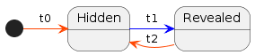
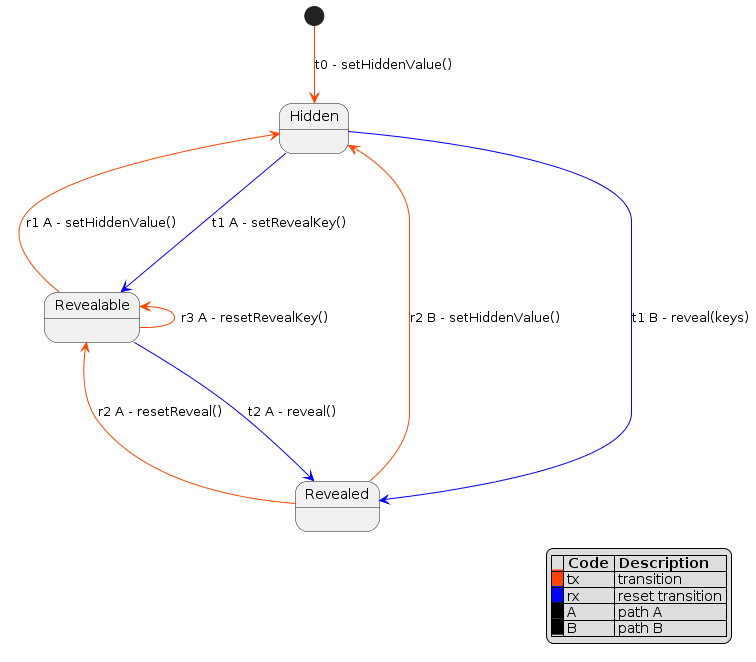

# Revealable On Chain Secret Scheme

This is a scheme to embed a **hidden value** in a smart contract that could be revealed by the owner of the contract.

## Motivation

The motivation for this system is to give the owner of a smart contract the ability to hide a value or values at the time of deployment, and reveal them later.

### A concret example: Primes

The initial idea was to hide which [Primes](https://www.primes.wtf/) will be minted by the collector during the drop.

The artist [g56d](https://www.g56d.art/) offers a series of OnChain NFTs that vary in rarity.

He doesn't want the collector to be aware of the differences in the intrinsic qualities of each NFT and thus avoid that some people buy the best ones first and the others do not want to buy the others anymore.

> Each NFT should have an equal chance of being bought.

In this way, the artist can set a unit price and leave it to chance to determine who will mint which NFT.

### Randomisation & obfuscation

If the list of NTF's id is published, and even if there is a pseudo-random distribution of tokens, the collector still has the possibility to calculate which NTFs he will mint.

There are two issues to be dealt with here. On the one hand the collector must not know what he is minting, on the other hand the order in which the NFTs are minted must be random.

The proposal suggests the following approach:

- The creator defines a variable (like ADN) from which he can deduce the qualities of the associated NFT, but it can just as easily be an incremental number sequence
- He creates a randomly ordered array of these variables
- He encrypts this array (or each entries) and encodes it in the contract before deployment or sends it to the contract after deployment
- Then, when the time comes, he decrypts the array

It can be argued here that the creator knows the position of the NFTs with more valuable qualities and could reserve them for himself to maximise his return on investment.
With a pseudo-random function (as the blockchain is a deterministic system), it could be made more difficult for the creator to reserve the most valuable NFTs.
But on the other hand, can we really blame him for wanting to make a living from his art?

## The scheme overview

### Uses cases


- The owner must prepare his value to hide and cipher it using a key and a intial vector.
- The owner must write down the ciphered value into the smart contract.
- The owner must test his smart contract to make sure everything works as expected.
- The owner must deploy the smart contract.


- The collector can mint the smart contract.
- The collector can call the smart contract but get the ciphered value .


- The owner can reveal the hidden value by calling a specific function that will write the key into the smart contract.
- The collector can call the smart contract and get the revealed value.

### Preparation & contract testing


- The owner generates a key and an intial vector.
- The owner prepares his value to hide and ciphers it using the key and the intial vector.
- The owner deploys the smart contract.
- The owner writes down the ciphered value into the smart contract.
- The owner tests his smart contract to make sure everything works as expected.

### Reveal


#### Contract usage before reveal

- Anyone can call the smart contract but get ciphered value.
- In the diagram above, the collector can mint the smart contract and get the ciphered value when calling the smart contract.

#### Reveal the hidden value

- The owner reveals the hidden value by calling a specific function that will decrypt the secret using the owner's private key and write the revealed value into the smart contract.

#### Contract usage after reveal

- once the hidden value is revealed, anyone can call the smart contract and get to know the value.

## Install & testing

- Clone the repo
- `npm` or `yarn` install

```bash
npm install
```

- create an `.env` file @ root of the folder and set the following variables:

```txt
DEFAULT_NETWORK = "hardhat"
ACCOUNT_PRIVATE_KEY = [add_your_keys]
REPORT_GAS = true
ETHERSCAN_API_KEY = add_your_key
COINMARKETCAP_API_KEY = add_your_key
```

- Launch tests

```bash
npx hardhat test
```

- Dive in the code `;)`

## Ciphering the data

### Using Cipher script

```terminal
$ npx hardhat cipher --source demo.json
                                                                                                                                                                                                
@@@@@@@   @@@@@@@@  @@@  @@@  @@@@@@@@   @@@@@@   @@@        @@@@@@   @@@@@@@   @@@       @@@@@@@@  
@@@@@@@@  @@@@@@@@  @@@  @@@  @@@@@@@@  @@@@@@@@  @@@       @@@@@@@@  @@@@@@@@  @@@       @@@@@@@@  
@@!  @@@  @@!       @@!  @@@  @@!       @@!  @@@  @@!       @@!  @@@  @@!  @@@  @@!       @@!       
!@!  @!@  !@!       !@!  @!@  !@!       !@!  @!@  !@!       !@!  @!@  !@   @!@  !@!       !@!       
@!@!!@!   @!!!:!    @!@  !@!  @!!!:!    @!@!@!@!  @!!       @!@!@!@!  @!@!@!@   @!!       @!!!:!    
!!@!@!    !!!!!:    !@!  !!!  !!!!!:    !!!@!!!!  !!!       !!!@!!!!  !!!@!!!!  !!!       !!!!!:    
!!: :!!   !!:       :!:  !!:  !!:       !!:  !!!  !!:       !!:  !!!  !!:  !!!  !!:       !!:       
:!:  !:!  :!:        ::!!:!   :!:       :!:  !:!   :!:      :!:  !:!  :!:  !:!   :!:      :!:       
::   :::   :: ::::    ::::     :: ::::  ::   :::   :: ::::  ::   :::   :: ::::   :: ::::   :: ::::  
 :   : :  : :: ::      :      : :: ::    :   : :  : :: : :   :   : :  :: : ::   : :: : :  : :: ::   
                                                                                                    
Key: 0xcaa6e3191f88601644b74e72893e1b392583b6a04f71511bcc2a8b7280933604
IV: 0xe92f5949babb53eb160f01da9321a6e7744a28f4795f38cb5bba1b6b73e1acbe
Secret to cipher:
4062,55174,23769,24456,46791,7236,39972,51902,58541,17820
Ciphered value:
766,10105,58665,13202,65495,53002,10655,64327,31668,28695

The ciphering data has been written into ./output:

        demo_ciphered.txt will contains your ciphered data
        demo.key will contains the key to use to reveal the ciphered data
        demo.iv will contains the initial vector to use to reveal the ciphered data
        demo_report.json will contains all the previous data

        keep them safe!

```

You can then deploy the contract and call the `setHiddenValue` method to send the generated Ciphered data into the smart contract.

### Output files

the `cipher` Hardhat task will output a series of files in a folder named `cipher_output_{filename}`.

- `{filename}_ciphered.txt` will contains your ciphered data
- `{filename}.key` will contains the key to use to reveal the ciphered data
- `{filename}.iv` will contains the initial vector to use to reveal the ciphered data
- `{filename}_report.json` will contains all the previous data json

```json
{
    "original_key": "",
    "original_Iv": "",
    "key_to_use": "0xcaa6e3191f88601644b74e72893e1b392583b6a04f71511bcc2a8b7280933604",
    "iv_to_use": "0xe92f5949babb53eb160f01da9321a6e7744a28f4795f38cb5bba1b6b73e1acbe",
    "ciphered_value_to_use": [
        766,
        10105,
        58665,
        13202,
        65495,
        53002,
        10655,
        64327,
        31668,
        28695
    ],
    "value_to_cipher": [
        4062,
        55174,
        23769,
        24456,
        46791,
        7236,
        39972,
        51902,
        58541,
        17820
    ],
    "hidden_value_bytes_size": 2
}
```

### Cipher task command

```bash
npx hardhat cipher --source {path_to_value_to_hide_JSON_file} --key {key} --iv {iv} --valuesize {value}
```

#### Source of value(s) to hide

The `--source` parameter is mandatory.

Path is relative to command execution not to the script.

```bash
--source {path_to_value_to_hide_JSON_file} # path to the JSON file containing the value to hide
```

The JSON file containing the value to hide must have a key named `value`.

The value can be a string, a number or an array.

```json
{
  "value": "my value to hide"
}
```

JSON file can optionally contains `key` and `iv` keys.

```json
{
  "value": "my value to hide",
  "key": "my key",
  "iv": "my iv"
}
```

If key and iv are provided, they will be used to cipher the value to hide.
Else, they will be generated randomly if not provided through the `--key` and `--iv` parameters.

#### Optional parameters

##### Key and IV

```bash
--key {key} # key to cipher the value to hide
--iv {iv} # iv to cipher the value to hide
```

If no key and iv are provided, they will be generated randomly.

##### Value to hide

```bash
--valuesize {value} # the size in byte of (each) value to hide
```

By default, the value to hide will be 2 bytes long.

## Implementation details

### Revealable contract state



The contract could only be in one of the following states:

- `Hidden`: the value to hide is set but not revealed
- `Revealed`: the value to hide is revealed

For now, there is no guard if the value to hide has not been set.

Under the hood, there's an internal state named `Revealable`. Its purpose is to reset the keys in case of sending wrong keys.

### Revealable contract state transition



There are 2 ways for the contract owner to reveal the value to hide (path A and path B).

#### Path A

- `setHiddenValue(value_to_hide,valueSize)`: the value to hide is set and the contract is in the `Hidden` state
- `reveal(keys, valueSize)`: the value to hide is revealed and the contract is in the `Revealed` state

#### Path B

- `setHiddenValue(value_to_hide,valueSize)`: the value to hide is set and the contract is in the `Hidden` state
- `setRevealKey(keys, valueSize)`: the value to hide is revealed and the contract is in the `Revealable` state
- `reveal()`: the value to hide is revealed and the contract is in the `Revealed` state

### Implementing the Revealable contract

In our example, the artist randomly defines an order in which the NFTs will be assigned.
He defines a list of values where each value will refer to an NFT. This can be a serial number, a DNA, an address.

Collectors will mint on a first come, first served basis. The attribution will be done in the order of minting.

Our value to hide is an array of 16 bytes.

```typescript
    uint16[] private _ids;
```

We started by defining a bijective encryption function. Here we have taken CTR, but there are other alternatives. bijective means that the encryption function is reversible.

The artist will be able to encrypt his array of values into an array of ciphered values using the chosen encryption function.

For the example, after performing all the necessary tests, we used *hardhat* and called the locally deployed contract to encrypt the array of values to be hidden.

```typescript
const cipherMessage = await this.reveal.cipher(data, key, iv);
```

We then hardcoded the resulting table into the contract.

```typescript
    uint16[] private _ids = [0x56f2,0x8eaa,0x05f5,0x06a4,0xefeb,0x4568,0xc508,0x9392,0xbd81,0x1cb0];
```

According to the description of IERC721Metadata, we need a `tokenURI(uint256 tokenId) → string` callable function which returns either a link to a resource or metadata that follow a certain schema. Since we are doing OnChain, we will return metadata instead.

```typescript
function tokenURI(
        uint256 tokenId
    ) public view virtual override returns (string memory) {
        _requireMinted(tokenId);
        return getMetadata(tokenId);
    }
```

There is not necessarily a reason to create a specific function to return the metadata.

We know that in the present *use case*, the tokenId value comes from an array of `uint16`, so it will have to be converted to `uint256` to comply with the signature of the `tokenURI(uint256 tokenId)` function.
The `tokenId` is received as an `uint256`, but the value or useful information is encoded in 2 bytes, so it will have to be converted again to get the right expected value.

```typescript
function getMetadata(
        uint256 tokenId
    ) public view virtual returns (string memory) {
        // callable only on minted token
        _requireMinted(tokenId);
        // the tokenId to be returned (revealed or not)
        uint256 displayId = tokenId;

        if(_isRevealed) {
            bytes memory revealedAsBytes = reveal(tokenId);
            bytes2 tempBytes2;
            // crop to bytes2
            assembly {
                tempBytes2 := mload(add(revealedAsBytes, 0x20))
            }
            // explicit conversion to the original size
            uint16 tempBytes16 = uint16(tempBytes2);
            // explicit cast to uint256
            displayId = uint256(tempBytes16);
        }

        return
            string.concat(
                "data:application/json;base64,",
                Base64.encode(
                    bytes(
                        string.concat(
                            '{"name": "Reveal #',
                            displayId.toString(),
                            '",',
                            '"description": "Reveal is a collection of on-chain NFTs"',
                            // add whatever you want
                            "}"
                        )
                    )
                )
            );
    }

```


## Pitfalls

### Costs

In this scheme, the owner needs to pay for the gas cost of keeping the hidden value to the smart contract. This is because the hidden value is stored in the smart contract.
Keeping the hidden value in storage will consume more gas because we need to pay for the block space.
The smaller the hidden value is, the cheaper it is to keep it in the smart contract.

### Hardhat Gas Report

```text
·----------------------------------|---------------------------|-------------|-----------------------------·
|       Solc version: 0.8.19       ·  Optimizer enabled: true  ·  Runs: 200  ·  Block limit: 30000000 gas  │
···································|···························|·············|······························
|  Methods                         ·               5 gwei/gas                ·       1774.45 usd/eth       │
·············|·····················|·············|·············|·············|···············|··············
|  Contract  ·  Method             ·  Min        ·  Max        ·  Avg        ·  # calls      ·  usd (avg)  │
·············|·····················|·············|·············|·············|···············|··············
|  Reveal    ·  approve            ·          -  ·          -  ·      48786  ·            4  ·       0.43  │
·············|·····················|·············|·············|·············|···············|··············
|  Reveal    ·  mint               ·      63027  ·      97227  ·      79367  ·           45  ·       0.70  │
·············|·····················|·············|·············|·············|···············|··············
|  Reveal    ·  safeTransferFrom   ·      40832  ·      62956  ·      58943  ·            6  ·       0.52  │
·············|·····················|·············|·············|·············|···············|··············
|  Reveal    ·  setApprovalForAll  ·      24376  ·      46288  ·      42636  ·            6  ·       0.38  │
·············|·····················|·············|·············|·············|···············|··············
|  Deployments                     ·                                         ·  % of limit   ·             │
···································|·············|·············|·············|···············|··············
|  CipherLib                       ·          -  ·          -  ·     264563  ·        0.9 %  ·       2.35  │
···································|·············|·············|·············|···············|··············
|  Reveal                          ·          -  ·          -  ·    1896619  ·        6.3 %  ·      16.83  │
·----------------------------------|-------------|-------------|-------------|---------------|-------------·
```
