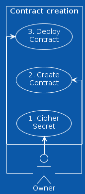
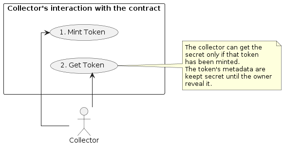
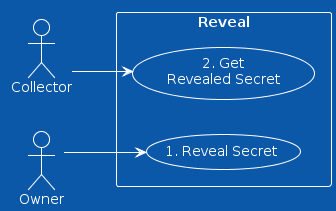
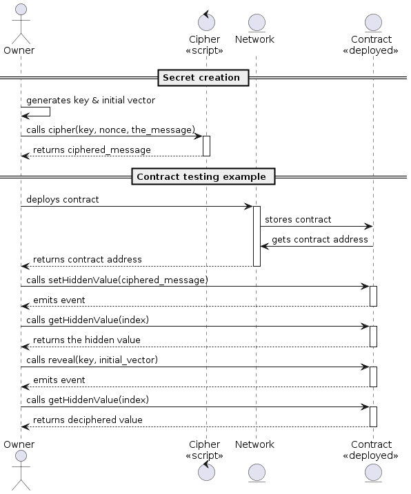
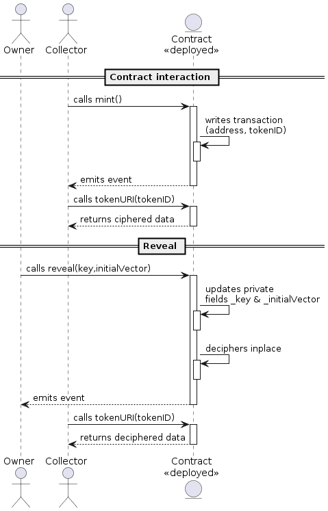

# Revealable On Chain Secret Scheme for NFT

This is a scheme to embed a **secret** in a smart contract that could be revealed by the owner of the contract.

## Motivation

The motivation for this scheme is to gives the owner of a smart contract the ability to hide a secret at deployment time, and reveal it later.

## A concret example

An artist offers a series of OnChain NFTs that vary in rarity.

The artist does not want the collector to be aware of the differences in the intrinsic qualities of each NFT so that some people will buy the best ones first and others will not want to buy the remaining NFTs.

Each NFT should have an equal chance of being bought.

In this way, the artist can set a unit price and leave it to chance to determine who will mint which NFT.

## Randomisation & obfuscation

If the list of NTFs is published, and even if there is a pseudo-random distribution of tokens, the collector still has the possibility to calculate which NTFs he will mint.

There are two issues to be dealt with here. On the one hand the collector must not know what he is minting, on the other hand the order in which the NFTs are minted must be random.

The proposal suggests the following approach:

- The creator defines a variable (like ADN) from which he can deduce the qualities of the associated NFT, but it can just as easily be an incremental number sequence
- He creates a randomly ordered array of these variables
- He encrypts this array (or each entries) and encodes it in the contract before deployment or sends it to the contract

It can be argued here that the creator knows the position of the NFTs with more valuable qualities and could reserve them for himself to maximise his return on investment.
With a pseudo-random function (as the blockchain is a deterministic system), it could be made more difficult for the creator to reserve the most valuable NFTs.
But on the other hand, can we really blame him for wanting to make a living from his art?

## The scheme overview

### Uses cases



- The owner must prepare his secret and cipher it using a key and a nonce.
- The owner must write down the ciphered secret to the smart contract before deployment (this could be done afterwards, but it may be more expensive, it remains to be proven)
- The owner must test his smart contract to make sure everything works as expected.
- The owner must deploy the smart contract.



- The collector can mint the smart contract.
- The collector can call the smart contract but get the ciphered secret.



- The owner can reveal the secret by calling a specific function that will write the key into the smart contract.
- The collector can call the smart contract and get the revealed secret.

### Preparation & contract creation



- The owner generates a key and a nonce.
- The owner prepares his secret and cipher it using the key and the nonce.
- The owner writes down the ciphered secret to the smart contract before deployment.
- The owner tests his smart contract to make sure everything works as expected.
- The owner deploys the smart contract.

### Reveal



#### Contract usage before reveal

- Anyone can call the smart contract but get ciphered secret.

#### Reveal: option 1

- The owner reveals the secret by calling a specific function that will write the key into the smart contract.
- when the key is written, anyone can call the smart contract and get the secret.

#### Reveal: option 2

- The owner reveals the secret by calling a specific function that will decrypt the secret using the owner's private key and write the revealed secret into the smart contract.

#### Contract usage after reveal

- once the secret is revealed, anyone can call the smart contract and get to know the secret.

## Install & testing

- Clone the repo
- `npm` or `yarn` install

```bash
npm install
```

- create an `.env` file @ root of the folder and set the following variables:

```txt
DEFAULT_NETWORK = "hardhat"
ACCOUNT_PRIVATE_KEY = [add_your_keys]
REPORT_GAS = true
ETHERSCAN_API_KEY = add_your_key
COINMARKETCAP_API_KEY = add_your_key
```

- Launch tests

```bash
npx hardhat test
```

- Dive in the code `;)`

## Example & implementation

In our example, the artist randomly defines an order in which the NFTs will be assigned.
He defines a list of values where each value will refer to an NFT. This can be a serial number, a DNA, an address.

Collectors will mine on a first come, first served basis. The allocation will be done in the order of minting.

Let's take an example of a secret that is an array of 16 bytes.

```typescript
    uint16[] private _ids;
```

We started by defining a symmetric encryption function. Here we have taken CTR, but there are other alternatives.

The artist will be able to encrypt his array of values into an array of secret values using the chosen encryption function.

For the example, after performing all the necessary tests, we used *hardhat* and called the locally deployed contract to encrypt the array of values to be hidden.

```typescript
const cipherMessage = await this.reveal.cipher(data, key, iv);
```

We then hardcoded the resulting table into the contract.

```typescript
    uint16[] private _ids = [0x56f2,0x8eaa,0x05f5,0x06a4,0xefeb,0x4568,0xc508,0x9392,0xbd81,0x1cb0];
```

According to the description of IERC721Metadata, we need a `tokenURI(uint256 tokenId) → string` callable function which returns either a link to a resource or metadata following a certain scheme. Since we are doing OnChain, we will return metadata instead.

```typescript
function tokenURI(
        uint256 tokenId
    ) public view virtual override returns (string memory) {
        _requireMinted(tokenId);
        return getMetadata(tokenId);
    }
```

There is not necessarily a reason to create a specific function to return the metadata.

We know that in the present *use case*, the tokenId value comes from an array of `uint16`, so it will have to be converted to `uint256` to comply with the signature of the `tokenURI(uint256 tokenId)` function.
The `tokenId` is received as an `uint256`, but the value or useful information is encoded in 2 bytes, so it will have to be converted again to get the right expected value.

```typescript
function getMetadata(
        uint256 tokenId
    ) public view virtual returns (string memory) {
        // callable only on minted token
        _requireMinted(tokenId);
        // the tokenId to be returned (revealed or not)
        uint256 displayId = tokenId;

        if(_isRevealed) {
            bytes memory revealedAsBytes = reveal(tokenId);
            bytes2 tempBytes2;
            // crop to bytes2
            assembly {
                tempBytes2 := mload(add(revealedAsBytes, 0x20))
            }
            // explicit conversion to the original size
            uint16 tempBytes16 = uint16(tempBytes2);
            // explicit cast to uint256
            displayId = uint256(tempBytes16);
        }

        return
            string.concat(
                "data:application/json;base64,",
                Base64.encode(
                    bytes(
                        string.concat(
                            '{"name": "Reveal #',
                            displayId.toString(),
                            '",',
                            '"description": "Reveal is a collection of on-chain NFTs"',
                            // add whatever you want
                            "}"
                        )
                    )
                )
            );
    }

```


## Pitfalls

### Costs

In this scheme, the owner needs to pay for the gas cost of keeping the secret to the smart contract. This is because the secret is stored in the smart contract.
Keeping the secret in storage will consume more gas because we need to pay for the block space.
The smaller the secret is, the cheaper it is to keep it in the smart contract.

### Hardhat Gas Report

```text
·----------------------------------|---------------------------|-------------|-----------------------------·
|       Solc version: 0.8.19       ·  Optimizer enabled: true  ·  Runs: 200  ·  Block limit: 30000000 gas  │
···································|···························|·············|······························
|  Methods                         ·               5 gwei/gas                ·       1774.45 usd/eth       │
·············|·····················|·············|·············|·············|···············|··············
|  Contract  ·  Method             ·  Min        ·  Max        ·  Avg        ·  # calls      ·  usd (avg)  │
·············|·····················|·············|·············|·············|···············|··············
|  Reveal    ·  approve            ·          -  ·          -  ·      48786  ·            4  ·       0.43  │
·············|·····················|·············|·············|·············|···············|··············
|  Reveal    ·  mint               ·      63027  ·      97227  ·      79367  ·           45  ·       0.70  │
·············|·····················|·············|·············|·············|···············|··············
|  Reveal    ·  safeTransferFrom   ·      40832  ·      62956  ·      58943  ·            6  ·       0.52  │
·············|·····················|·············|·············|·············|···············|··············
|  Reveal    ·  setApprovalForAll  ·      24376  ·      46288  ·      42636  ·            6  ·       0.38  │
·············|·····················|·············|·············|·············|···············|··············
|  Deployments                     ·                                         ·  % of limit   ·             │
···································|·············|·············|·············|···············|··············
|  CipherLib                       ·          -  ·          -  ·     264563  ·        0.9 %  ·       2.35  │
···································|·············|·············|·············|···············|··············
|  Reveal                          ·          -  ·          -  ·    1896619  ·        6.3 %  ·      16.83  │
·----------------------------------|-------------|-------------|-------------|---------------|-------------·
```
