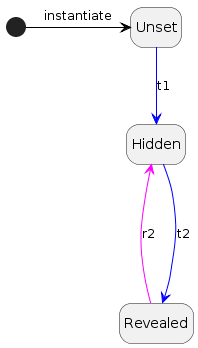

# Revealable On Chain Secret Scheme

This is a scheme to embed a **hidden value** in a smart contract that could be revealed by the owner of the contract.

## Motivation

The motivation for this system is to give the owner of a smart contract the ability to hide a value or values at the time of deployment, and reveal them later.

### A concret example: Primes

The initial idea was to hide which [Primes](https://www.primes.wtf/) will be minted by the collector during the drop.

The artist [g56d](https://www.g56d.art/) offers a series of OnChain NFTs that vary in rarity.

He doesn't want the collector to be aware of the differences in the intrinsic qualities of each NFT and thus avoid that some people buy the best ones first and the others do not want to buy the others anymore.

> Each NFT should have an equal chance of being bought.

In this way, the artist can set a unit price and leave it to chance to determine who will mint which NFT.

### Randomisation & obfuscation

If the list of NTF's id is published, and even if there is a pseudo-random distribution of tokens, the collector still has the possibility to calculate which NTFs he will mint.

There are two issues to be dealt with here. On the one hand the collector must not know what he is minting, on the other hand the order in which the NFTs are minted must be random.

The proposal suggests the following approach:

- The creator defines a variable (like ADN) from which he can deduce the qualities of the associated NFT, but it can just as easily be an incremental number sequence
- He creates a randomly ordered array of these variables
- He encrypts this array (or each entries) and encodes it in the contract before deployment or sends it to the contract after deployment
- Then, when the time comes, he decrypts the array

It can be argued here that the creator knows the position of the NFTs with more valuable qualities and could reserve them for himself to maximise his return on investment.
With a pseudo-random function (as the blockchain is a deterministic system), it could be made more difficult for the creator to reserve the most valuable NFTs.
But on the other hand, can we really blame him for wanting to make a living from his art?

## The scheme overview

### Uses cases


- The owner must prepare his value to hide and cipher it using a key and a intial vector.
- The owner must write down the ciphered value into the smart contract.
- The owner must test his smart contract to make sure everything works as expected.
- The owner must deploy the smart contract.


- The collector can mint the smart contract.
- The collector can call the smart contract but get the ciphered value .


- The owner can reveal the hidden value by calling a specific function that will write the key into the smart contract.
- The collector can call the smart contract and get the revealed value.

### Preparation & contract testing


- The owner generates a key and an intial vector.
- The owner prepares his value to hide and ciphers it using the key and the intial vector.
- The owner deploys the smart contract.
- The owner writes down the ciphered value into the smart contract.
- The owner tests his smart contract to make sure everything works as expected.

### Reveal


#### Contract usage before reveal

- Anyone can call the smart contract but get ciphered value.
- In the diagram above, the collector can mint the smart contract and get the ciphered value when calling the smart contract.

#### Reveal the hidden value

- The owner reveals the hidden value by calling a specific function that will decrypt the secret using the owner's private key and write the revealed value into the smart contract.

#### Contract usage after reveal

- once the hidden value is revealed, anyone can call the smart contract and get to know the value.

## Install & testing

- Clone the repo
- `npm` or `yarn` install

```bash
npm install
```

- create an `.env` file @ root of the folder and set the following variables:

```txt
DEFAULT_NETWORK = "hardhat"
ACCOUNT_PRIVATE_KEY = [add_your_keys]
REPORT_GAS = true
ETHERSCAN_API_KEY = add_your_key
COINMARKETCAP_API_KEY = add_your_key
```

- Launch tests

```bash
npx hardhat test
```

- Dive in the code `;)`

## Ciphering the data

### Using Cipher script

Use the `cipher` hardhat task to cipher your data.

```text
$ npx hardhat cipher --source demo.json

@@@@@@@   @@@@@@@@  @@@  @@@  @@@@@@@@   @@@@@@   @@@        @@@@@@   @@@@@@@   @@@       @@@@@@@@  
@@@@@@@@  @@@@@@@@  @@@  @@@  @@@@@@@@  @@@@@@@@  @@@       @@@@@@@@  @@@@@@@@  @@@       @@@@@@@@  
@@!  @@@  @@!       @@!  @@@  @@!       @@!  @@@  @@!       @@!  @@@  @@!  @@@  @@!       @@!       
!@!  @!@  !@!       !@!  @!@  !@!       !@!  @!@  !@!       !@!  @!@  !@   @!@  !@!       !@!       
@!@!!@!   @!!!:!    @!@  !@!  @!!!:!    @!@!@!@!  @!!       @!@!@!@!  @!@!@!@   @!!       @!!!:!    
!!@!@!    !!!!!:    !@!  !!!  !!!!!:    !!!@!!!!  !!!       !!!@!!!!  !!!@!!!!  !!!       !!!!!:    
!!: :!!   !!:       :!:  !!:  !!:       !!:  !!!  !!:       !!:  !!!  !!:  !!!  !!:       !!:       
:!:  !:!  :!:        ::!!:!   :!:       :!:  !:!   :!:      :!:  !:!  :!:  !:!   :!:      :!:       
::   :::   :: ::::    ::::     :: ::::  ::   :::   :: ::::  ::   :::   :: ::::   :: ::::   :: ::::  
 :   : :  : :: ::      :      : :: ::    :   : :  : :: : :   :   : :  :: : ::   : :: : :  : :: ::   
                                                                                                    
Key: 0xcaa6e3191f88601644b74e72893e1b392583b6a04f71511bcc2a8b7280933604
IV: 0xe92f5949babb53eb160f01da9321a6e7744a28f4795f38cb5bba1b6b73e1acbe
Value to cipher:
4062,55174,23769,24456,46791,7236,39972,51902,58541,17820
Ciphered value as bytes:
0xde0f86d7d95c885fc7b6441c249cbecaade49c45
Ciphered value:
766,10105,58665,13202,65495,53002,10655,64327,31668,28695

The ciphering data has been written into ./cipher_output_demo:

        demo_ciphered_bytes.txt will contains your ciphered data as bytes (best to use this one)
        demo_ciphered_array.txt will contains your ciphered data as an array of values
        demo.key will contains the key to use to reveal the ciphered data
        demo.iv will contains the initial vector to use to reveal the ciphered data
        demo_report.json will contains all the previous data

        keep them safe!

```

Then you will have to deploy your contract and call the `setHiddenValue` method to send the generated Ciphered data into the smart contract.

### Cipher task output files

the `cipher` Hardhat task will output a series of files in a folder named `cipher_output_{filename}`.

- `{filename}_ciphered_bytes.txt` will contains your ciphered data as bytes. This is the best way to send the data into the smart contract. It is gaz cheaper to send bytes than to send an array of values.
- `{filename}_ciphered_array.txt` will contains your ciphered data as an array of integer values.
- `{filename}.key` will contains the key to use to reveal the ciphered data
- `{filename}.iv` will contains the initial vector to use to reveal the ciphered data
- `{filename}_report.json` will contains all the previous data json

#### Example of report file

```json
{
    "original_key": "",
    "original_Iv": "",
    "key_to_use": "0xcaa6e3191f88601644b74e72893e1b392583b6a04f71511bcc2a8b7280933604",
    "iv_to_use": "0xe92f5949babb53eb160f01da9321a6e7744a28f4795f38cb5bba1b6b73e1acbe",
    "ciphered_as_bytes": "0xde0f86d7d95c885fc7b6441c249cbecaade49c45",
    "ciphered_as_array": [
        766,
        10105,
        58665,
        13202,
        65495,
        53002,
        10655,
        64327,
        31668,
        28695
    ],
    "hidden_value_bytes_size": 2
}
```

### Cipher task command with arguments

```bash
npx hardhat cipher --source {path_to_value_to_hide_JSON_file} --key {key} --iv {iv} --valuesize {value}
```

#### Source of value(s) to hide

The `--source` parameter is mandatory.

Path is relative to command execution not to the script.

```bash
--source {path_to_value_to_hide_JSON_file} # path to the JSON file containing the value to hide
```

The JSON file containing the value to hide must have a key named `value`.

The value can be a string, a number or an array.

```json
{
  "value": "my value to hide"
}
```

JSON file can optionally contains `key` and `iv` keys. Those are limited to 32 bytes.

```json
{
  "value": "my value to hide",
  "key": "my key",
  "iv": "my iv"
}
```

If key and iv are provided, they will be used to cipher the value to hide.
If no key or iv are provided, they will be generated randomly.

#### Optional parameters

##### Key and IV

```bash
--key {key} # key to cipher the value to hide
--iv {iv} # iv to cipher the value to hide
```

If no key and iv are provided, they will be generated randomly.

##### Size of value to hide

In the current implementation, each value have to be the same size. Initially, the value to hide was an array and the `setHiddenValue` method simply pushed the value to hide into an array in the smart contract.
An enhancement was made to reduce the space used in the smart contract when the value to hide is smaller than 32 bytes. The value to hide is now stored as concatenated bytes. But you still to provide the byte size of the value to hide.

```bash
--valuesize {value} # the size in byte of (each) value to hide
```

By default, the value to hide will be 2 bytes long.

## Implementation details

### Revealable contract state



The contract could only be in one of the following states:

- `Unset`: the value to hide is not set
- `Hidden`: the value to hide is set but not revealed
- `Revealed`: the value to hide is revealed

Under the hood, there's an internal state named `Revealable`. Its purpose is to reset the keys in case of sending wrong keys.

### Revealable contract state transition


There are 2 ways for the contract owner to reveal the hidden value (path A and path B).

#### Path A

- [`t0`] `setHiddenValue(value_to_hide)`: the value to hide is set and the contract is in the `Hidden` state
- [`t1`] `setRevealKey(key, iv, valueSize)`: the value to hide is revealed and the contract is in the `Revealable` state
- [`t2`] `reveal()`: the value to hide is revealed and the contract is in the `Revealed` state

#### Path B

- [`t0`] `setHiddenValue(value_to_hide)`: the value to hide is set and the contract is in the `Hidden` state
- [`t1`] `reveal(keys, valueSize)`: the value to hide is revealed and the contract is in the `Revealed` state

### Reveal Contract: a quick implementation example

For an example of implementation, you can check the `Reveal.sol` contract.

The Reveal contract is a simple contract that allows the owner to reveal an hidden value using the Reveable contract.

## Pitfalls

### Costs

In this scheme, the owner needs to pay for the gas cost of keeping the hidden value to the smart contract. This is because the hidden value is stored in the smart contract.
Keeping the hidden value in storage will consume more gas because we need to pay for the block space.
The smaller the hidden value is, the cheaper it is to keep it in the smart contract.

### Hardhat Gas Report

```text

  Revealable Contract testing
    ✓ should revert if Unset
    ✓ should revert if key or iv equal 0
    ✓ should set the hidden values
    ✓ should emit event when setting the hidden values
    ✓ should revert if index out of range
    ✓ should cipher values
    ✓ should decipher hidden value if revealed
    ✓ should cipher and decipher if revealed
    ✓ should return cipher values as byte
    ✓ should setHiddenValues with bytes

·----------------------------------|---------------------------|-------------|-----------------------------·
|       Solc version: 0.8.18       ·  Optimizer enabled: true  ·  Runs: 200  ·  Block limit: 30000000 gas  │
···································|···························|·············|······························
|  Methods                         ·               5 gwei/gas                ·       1837.64 usd/eth       │
···············|···················|·············|·············|·············|···············|··············
|  Contract    ·  Method           ·  Min        ·  Max        ·  Avg        ·  # calls      ·  usd (avg)  │
···············|···················|·············|·············|·············|···············|··············
|  Revealable  ·  resetReveal      ·          -  ·          -  ·      38956  ·            1  ·       0.36  │
···············|···················|·············|·············|·············|···············|··············
|  Revealable  ·  reveal           ·          -  ·          -  ·      41216  ·            7  ·       0.38  │
···············|···················|·············|·············|·············|···············|··············
|  Revealable  ·  setHiddenValues  ·          -  ·          -  ·      81026  ·            8  ·       0.74  │
···············|···················|·············|·············|·············|···············|··············
|  Revealable  ·  setHiddenValues  ·      32408  ·      52308  ·      45675  ·            3  ·       0.42  │
···············|···················|·············|·············|·············|···············|··············
|  Revealable  ·  setRevealKey     ·      35183  ·      77783  ·      72458  ·            8  ·       0.67  │
···············|···················|·············|·············|·············|···············|··············
|  Deployments                     ·                                         ·  % of limit   ·             │
···································|·············|·············|·············|···············|··············
|  Revealable                      ·          -  ·          -  ·    1185754  ·          4 %  ·      10.89  │
·----------------------------------|-------------|-------------|-------------|---------------|-------------·

  10 passing (8s)

```

## Disclaimer

Before using this code, please read the following disclaimer:

- This is not a production-ready code.
- It is just a proof of concept.
- It is not audited and it is not fully tested in a real environment.
- It is provided as is without any warranty of any kind.
- I am not responsible for any loss of funds or any other damage caused by the use of this code.
- Use it at your own risk.
