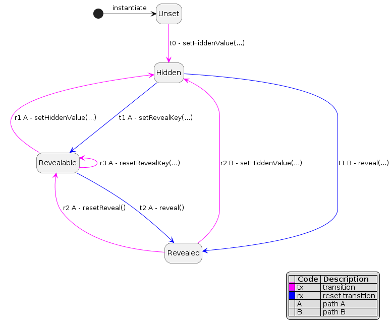

# Revealable

Revealable is a scheme designed to incorporate a *hidden value* in a smart contract that can be exposed by the contract owner at a later stage.

## Motivation

The main objective of this scheme is to enable the contract owner to conceal one or more values at the moment of deployment, and later reveal them as required.

### A concret example: Primes

As a practical example, the idea originated from concealing the NFTs of [Primes](https://www.primes.wtf/) during a drop to ensure that each NFT has an equal chance of being purchased. The artist behind the NFTs, [g56d](https://www.g56d.art/), wished to offer a series of OnChain NFTs of varying rarity without revealing their intrinsic qualities.

### Randomisation & obfuscation

If the list of NTF's id is published, and even if there is a pseudo-random distribution of tokens, the collector still has the possibility to calculate which NTFs he will mint.

There are two issues to be dealt with here. On the one hand the collector must not know what he is minting, on the other hand the order in which the NFTs are minted must be random.

To achieve randomisation and obfuscation, the proposal suggests the following approach: the creator establishes a variable, such as a DNA, to deduce the qualities of each associated NFT, and creates a randomly ordered array of these variables, which is encrypted and encoded in the contract before or after deployment, before being decrypted when required.

It could be argued that the creator may reserve the NFTs with more valuable qualities for themselves to maximise their return on investment. However, by using a pseudo-random function, it could be more difficult for the creator to manipulate the system, as the blockchain is deterministic.

Nonetheless, it is understandable that an artist wishes to make a living from their work, so it is important to strike a balance between fair distribution and profit-making.

## Overview of the Revealable Scheme

Revealable is a scheme that enables smart contract owners to hide a value or an array of values at the time of deployment, and reveal them later. 
Here's how the process works:

### Use Cases


- The owner prepares the value to hide and encrypts it using a key and an initial vector.
- The owner tests the smart contract to ensure it works as expected.
- The owner deploys the smart contract.
- The owner writes the encrypted value into the smart contract.


- The collector can mint the smart contract.
- The collector can call the smart contract but only gets the encrypted value.


- The owner can reveal the hidden value by calling a specific function that writes the key into the smart contract.
- The collector can call the smart contract and retrieve the revealed value.

### Preparation and Contract Testing


- The owner generates a key and an initial vector.
- The owner encrypts the value to hide using the key and initial vector.
- The owner deploys the smart contract.
- The owner writes the encrypted value into the smart contract.
- The owner tests the smart contract to ensure everything works as intended.

### Reveal Sequence


#### Contract Usage Before Reveal

- Anyone can call the smart contract, but they will only retrieve the encrypted value.
- In the diagram above, the collector can call the smart contract to mint it, but they will only retrieve the encrypted value.

#### Reveal the Hidden Value

- The owner can reveal the hidden value by calling a specific function that stores their private key in the contract. 

#### Contract Usage After Reveal

- Once the hidden value is revealed, anyone can call the smart contract to retrieve it.

### Quick Implementation Example: Reveal Contract

For an example of implementation, refer to the `Reveal.sol` contract. This contract enables the owner to reveal a hidden value using the Revealable scheme.

## Install & testing

- Clone the repo
- `npm` or `yarn` install

```bash
npm install
```

- create an `.env` file @ root of the folder and set the following variables:

```txt
DEFAULT_NETWORK = "hardhat"
ACCOUNT_PRIVATE_KEY = [add_your_keys]
REPORT_GAS = true
ETHERSCAN_API_KEY = add_your_key
COINMARKETCAP_API_KEY = add_your_key
```

- Launch tests

```bash
npx hardhat test
```

- Dive in the code `;)`

### Cipher Script Usage

Here are the detailed instructions on how to use the Cipher script to cipher data, and the necessary parameters and output files.

### Using Cipher script

To use the Cipher script, one should first execute the `cipher` hardhat task to cipher the data. 

```text
$ npx hardhat cipher --source demo.json

@@@@@@@   @@@@@@@@  @@@  @@@  @@@@@@@@   @@@@@@   @@@        @@@@@@   @@@@@@@   @@@       @@@@@@@@  
@@@@@@@@  @@@@@@@@  @@@  @@@  @@@@@@@@  @@@@@@@@  @@@       @@@@@@@@  @@@@@@@@  @@@       @@@@@@@@  
@@!  @@@  @@!       @@!  @@@  @@!       @@!  @@@  @@!       @@!  @@@  @@!  @@@  @@!       @@!       
!@!  @!@  !@!       !@!  @!@  !@!       !@!  @!@  !@!       !@!  @!@  !@   @!@  !@!       !@!       
@!@!!@!   @!!!:!    @!@  !@!  @!!!:!    @!@!@!@!  @!!       @!@!@!@!  @!@!@!@   @!!       @!!!:!    
!!@!@!    !!!!!:    !@!  !!!  !!!!!:    !!!@!!!!  !!!       !!!@!!!!  !!!@!!!!  !!!       !!!!!:    
!!: :!!   !!:       :!:  !!:  !!:       !!:  !!!  !!:       !!:  !!!  !!:  !!!  !!:       !!:       
:!:  !:!  :!:        ::!!:!   :!:       :!:  !:!   :!:      :!:  !:!  :!:  !:!   :!:      :!:       
::   :::   :: ::::    ::::     :: ::::  ::   :::   :: ::::  ::   :::   :: ::::   :: ::::   :: ::::  
 :   : :  : :: ::      :      : :: ::    :   : :  : :: : :   :   : :  :: : ::   : :: : :  : :: ::   
                                                                                                    
Key: 0xcaa6e3191f88601644b74e72893e1b392583b6a04f71511bcc2a8b7280933604
IV: 0xe92f5949babb53eb160f01da9321a6e7744a28f4795f38cb5bba1b6b73e1acbe
Value to cipher:
4062,55174,23769,24456,46791,7236,39972,51902,58541,17820
Ciphered value as bytes:
0xde0f86d7d95c885fc7b6441c249cbecaade49c45
Ciphered value:
766,10105,58665,13202,65495,53002,10655,64327,31668,28695

The ciphering data has been written into ./cipher_output_demo:

        demo_ciphered_bytes.txt will contains your ciphered data as bytes (best to use this one)
        demo_ciphered_array.txt will contains your ciphered data as an array of values
        demo.key will contains the key to use to reveal the ciphered data
        demo.iv will contains the initial vector to use to reveal the ciphered data
        demo_report.json will contains all the previous data

        keep them safe!

```

Then, the user must deploy the smart contract and call the `setHiddenValue` method to send the generated Ciphered data into the smart contract.

The `cipher` task can be executed using the following command with arguments:

```bash
npx hardhat cipher --source {path_to_value_to_hide_JSON_file} --key {key} --iv {iv} --valuesize {value}
```

#### Source of value(s) to hide

The `--source` parameter is mandatory and should be the path to the JSON file containing the value to hide. 

```bash
--source {path_to_value_to_hide_JSON_file} # path to the JSON file containing the value to hide
```

The JSON file must have a key named `value`, which can be a string, a number, or an array.

```json
{
  "value": "my value to hide"
}
```

 If the `key` and `iv` keys are also present in the JSON file, they will be used to cipher the value to hide. If not, they will be generated randomly.

```json
{
  "value": "my value to hide",
  "key": "my key",
  "iv": "my iv"
}
```

If the user wants to provide the `key` and `iv` parameters manually, they can do so using the `--key` and `--iv` arguments. However, the provided key and iv must be limited to 32 bytes.

```bash
--key {key} # key to cipher the value to hide
--iv {iv} # iv to cipher the value to hide
```

If no key and iv are provided, they will be generated randomly.

##### Size of value to hide

The `--valuesize` argument is optional and should be used to specify the byte size of the value to hide. If not provided, the value to hide will be 2 bytes long. Note that each value must be the same size in the current implementation.

```bash
--valuesize {value} # the size in byte of (each) value to hide
```

By default, the value to hide will be 2 bytes long.

### Cipher task output files

After executing the `cipher` task, several files will be generated in a folder named `cipher_output_{filename}`. 

- The `{filename}_ciphered_bytes.txt` file will contain the ciphered data as bytes, which is the most efficient way to send the data into the smart contract. 
- The `{filename}_ciphered_array.txt` file will contain the ciphered data as an array of integer values. 
- The `{filename}.key` file will contain the key to use to reveal the ciphered data, while the `{filename}.iv` file will contain the initial vector to use to reveal the ciphered data. 
- The `{filename}_report.json` file will contain all the previous data in JSON format.

#### Example of report file

```json
{
    "original_key": "",
    "original_Iv": "",
    "key_to_use": "0xcaa6e3191f88601644b74e72893e1b392583b6a04f71511bcc2a8b7280933604",
    "iv_to_use": "0xe92f5949babb53eb160f01da9321a6e7744a28f4795f38cb5bba1b6b73e1acbe",
    "ciphered_as_bytes": "0xde0f86d7d95c885fc7b6441c249cbecaade49c45",
    "ciphered_as_array": [
        766,
        10105,
        58665,
        13202,
        65495,
        53002,
        10655,
        64327,
        31668,
        28695
    ],
    "hidden_value_bytes_size": 2
}
```

## Implementation details

### Revealable contract state


The contract could only be in one of the following states:

- `Unset`: the value to hide is not set
- `Hidden`: the value to hide is set but not revealed
- `Revealed`: the value to hide is revealed

Under the hood, there's an internal state named `Revealable`. Its purpose is to reset the keys in case of sending wrong keys.

### Revealable contract state transition



There are 2 ways for the contract owner to reveal the hidden value (path A and path B).

#### Path A

- [`t0`] `setHiddenValue(value_to_hide)`: the value to hide is set and the contract is in the `Hidden` state
- [`t1`] `setRevealKey(key, iv, valueSize)`: the value to hide is revealed and the contract is in the `Revealable` state
- [`t2`] `reveal()`: the value to hide is revealed and the contract is in the `Revealed` state

#### Path B

- [`t0`] `setHiddenValue(value_to_hide)`: the value to hide is set and the contract is in the `Hidden` state
- [`t1`] `reveal(keys, valueSize)`: the value to hide is revealed and the contract is in the `Revealed` state

## Pitfalls

### Costs

In this scheme, the owner needs to pay for the gas cost of keeping the hidden value to the smart contract. This is because the hidden value is stored in the smart contract.
Keeping the hidden value in storage will consume more gas because we need to pay for the block space.
The smaller the hidden value is, the cheaper it is to keep it in the smart contract.

## Hardhat Gas Report

```text

  Revealable Contract testing
    ✓ should revert if Unset
    ✓ should revert if key or iv equal 0
    ✓ should set the hidden values
    ✓ should emit event when setting the hidden values
    ✓ should revert if index out of range
    ✓ should cipher values
    ✓ should decipher hidden value if revealed
    ✓ should cipher and decipher if revealed
    ✓ should return cipher values as byte
    ✓ should setHiddenValues with bytes

·----------------------------------|---------------------------|-------------|-----------------------------·
|       Solc version: 0.8.18       ·  Optimizer enabled: true  ·  Runs: 200  ·  Block limit: 30000000 gas  │
···································|···························|·············|······························
|  Methods                         ·               5 gwei/gas                ·       1837.64 usd/eth       │
···············|···················|·············|·············|·············|···············|··············
|  Contract    ·  Method           ·  Min        ·  Max        ·  Avg        ·  # calls      ·  usd (avg)  │
···············|···················|·············|·············|·············|···············|··············
|  Revealable  ·  resetReveal      ·          -  ·          -  ·      38956  ·            1  ·       0.36  │
···············|···················|·············|·············|·············|···············|··············
|  Revealable  ·  reveal           ·          -  ·          -  ·      41216  ·            7  ·       0.38  │
···············|···················|·············|·············|·············|···············|··············
|  Revealable  ·  setHiddenValues  ·          -  ·          -  ·      81026  ·            8  ·       0.74  │
···············|···················|·············|·············|·············|···············|··············
|  Revealable  ·  setHiddenValues  ·      32408  ·      52308  ·      45675  ·            3  ·       0.42  │
···············|···················|·············|·············|·············|···············|··············
|  Revealable  ·  setRevealKey     ·      35183  ·      77783  ·      72458  ·            8  ·       0.67  │
···············|···················|·············|·············|·············|···············|··············
|  Deployments                     ·                                         ·  % of limit   ·             │
···································|·············|·············|·············|···············|··············
|  Revealable                      ·          -  ·          -  ·    1185754  ·          4 %  ·      10.89  │
·----------------------------------|-------------|-------------|-------------|---------------|-------------·

  10 passing (8s)

```

### Caveats

- The security of the scheme relies heavily on the security of the encryption algorithm used. If the encryption algorithm is compromised, an attacker could potentially recover the hidden value without needing the keys.
- If the keys used to encrypt the hidden value are lost or forgotten, the hidden value will become irretrievable. It is therefore important to keep backup copies of the keys in a secure location.
- Depending on the specifics of the use case, there may be legal or regulatory requirements governing the storage and handling of sensitive data. It is important to ensure that the use of this scheme complies with any relevant laws or regulations.

### Disclaimer

Please note the following disclaimer before using the Revealable scheme:

- This code is not intended for production use, but rather serves as a proof of concept.
- It has not been audited or fully tested in a real environment, and therefore may contain bugs or vulnerabilities.
- It is provided "as is" without any warranty of any kind.
- The owner of the contract is solely responsible for any loss of funds or other damages caused by the use of this code.
- Use this code at your own risk.
